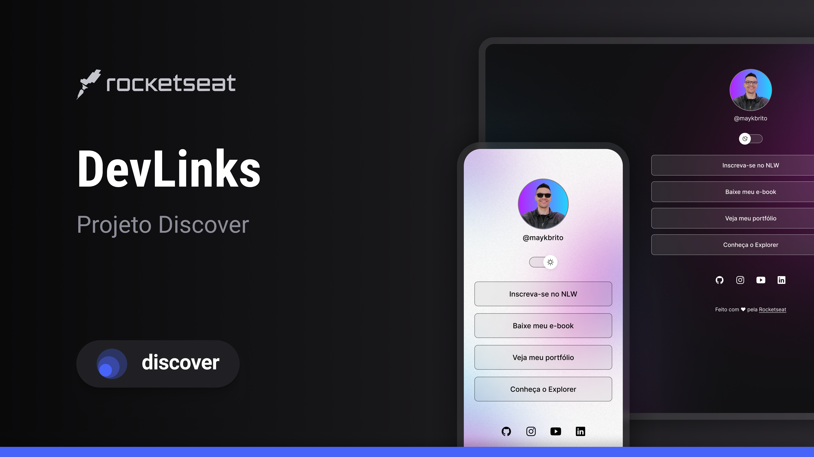

<h1 align="center"> LinkTree </h1>

<a href="https://debstd22.github.io/LinkTree/">Acesse o projeto finalizado clicando aqui</a>

   <a href="#tecnologias-utilizadas">Tecnologias Utilizadas</a>&nbsp;&nbsp;&nbsp;|&nbsp;&nbsp;&nbsp;
   <a href="#funcionalidades">Funcionalidades</a>&nbsp;&nbsp;&nbsp;|&nbsp;&nbsp;&nbsp;
   <a href="#objetivo-do-projeto">Objetivo do Projeto</a>&nbsp;&nbsp;&nbsp;|&nbsp;&nbsp;&nbsp;
   <a href="#layout">Layout</a>&nbsp;&nbsp;&nbsp;

&nbsp;

&nbsp;

Projeto de uma página estilo Linktree desenvolvida com HTML, CSS e JavaScript, com o objetivo de centralizar links importantes em uma interface simples, responsiva e personalizada.

Este projeto foi desenvolvido com base nos conhecimentos adquiridos na trilha Discover da Rocketseat, aplicando na prática conceitos fundamentais do desenvolvimento front-end.

## Tecnologias Utilizadas

- HTML5

- CSS3 (Flexbox e responsividade)

- JavaScript (interatividade e manipulação do DOM)

## Funcionalidades

- Exibição de foto de perfil e nome do usuário

- Lista de links personalizados

- Design responsivo (adaptado para mobile e desktop)

- Efeitos visuais com hover nos botões

- Modo noturno

- Estrutura simples e de fácil manutenção

## Objetivo do Projeto

Praticar e consolidar conhecimentos em desenvolvimento front-end, utilizando boas práticas de estruturação, estilização e interatividade, além de transformar o aprendizado teórico da trilha Discover em um projeto real.

## Layout

Você pode visualizar o layout do projeto <a href="https://www.figma.com/design/NW95gdv54Iqw6ysGk7ulKU/DevLinks-%E2%80%A2-Projeto-Discover--Community-?node-id=10-620&p=f&t=t8Bj5SHU6UfaXfvt-0">CLICANDO AQUI</a>. É necessário ter conta do <a href="https://www.figma.com/login?is_not_gen_0=true">FIGMA</a> para acessá-lo.
